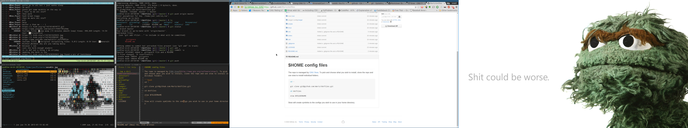

#$HOME config files

The repo is managed by [GNU Stow](http://www.gnu.org/software/stow/). To pick and choose what you wish to install, clone the repo and use stow to install individual folders.

```bash
cd ~

git clone git@github.com:Wartz/dotfiles.git

cd dotfiles

stow $FOLDERNAME 
```

Stow will create symlinks to the configs you wish to use in your home directory.


